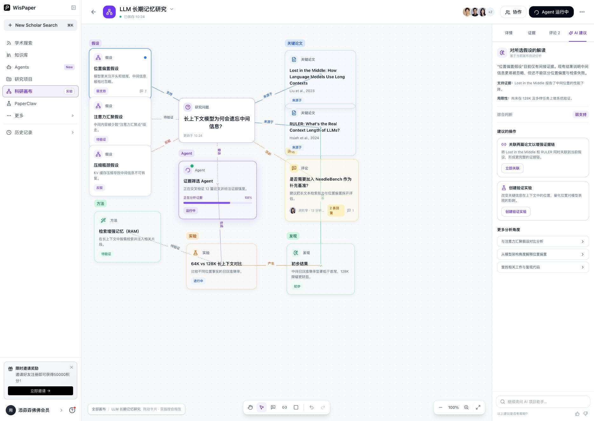

# 科研画布产品 Proposal

> 从“项目文件夹”升级为可推演、可协作、可执行的科研空间  
> WisPaper 产品提案 · MVP · 2026-07-31

## 1. 执行摘要

科研画布是 WisPaper 对现有 Project 模块的一次产品形态升级：从低频的项目资料管理空间，转向一个面向长期研究过程的可视化工作台。

用户在无限画布中组织研究问题、假设、论文、方法、实验、发现、评论与 Agent，并通过可追踪的连接关系表达：

- 为什么形成当前判断；
- 哪些证据支持或反驳判断；
- 下一步需要验证什么；
- 实验和 Agent 的产物如何改变研究方向。

MVP 不以复刻 Miro 或通用思维导图为目标，而是验证一个更窄的产品命题：

> 当画布原生理解科研对象与证据关系，并允许 AI 直接给出关联建议、证据强度判断和可执行实验时，用户是否会更频繁地回到项目空间，并把它作为研究进展的主要窗口？

建议以左侧栏“科研画布 · 实验”作为独立测试入口，面向已有 Project 用户和高频 Library/Agent 用户开展 6–8 周封闭测试；验证成立后，再决定是否并入或替换 Project 一级入口。

## 2. 背景与机会

### 2.1 当前问题

- Project 更接近文件夹与条目管理，能够归档材料，但难以呈现项目的因果链、证据链与决策变化。
- 科研过程天然是非线性的。用户会在问题、假设、论文、实验和发现之间反复跳转，线性列表很难表达这种结构。
- Library、Agent、Scholar Search 已经积累大量研究对象，但缺少跨工具的“项目级视图”，信息容易在任务完成后失去上下文。
- 通用白板可以画关系，但不理解论文、证据强度、实验状态与 Agent 任务，AI 介入往往停留在生成便签或总结文本。

### 2.2 产品机会

科研画布可以成为 WisPaper 的研究操作层：

- Library 提供材料；
- Scholar Search 提供发现；
- Agent 提供自动化执行；
- 科研画布把这些对象组织为持续演化的研究模型。

它不仅展示项目进度，还解释进度背后的逻辑，并承接下一步行动。

## 3. 产品定位

| 维度 | 定义 |
|---|---|
| 一句话定位 | 面向科研项目的 AI 原生逻辑画布，用可视化关系组织研究对象，并把判断直接转化为下一步行动。 |
| 核心用户 | 正在进行文献调研、开题、复现、实验设计或长期课题推进的研究者与小型科研团队。 |
| 核心任务 | 梳理研究问题与假设；建立证据链；设计与跟踪实验；记录结论变化；协调 Agent 与协作者。 |
| 差异化 | 不是通用白板，也不是文件夹视图；画布理解科研对象类型、关系语义、证据强弱和 Agent 运行状态。 |
| 与现有模块的关系 | Library 管材料，Agent 做任务，Project/Canvas 管研究逻辑与推进过程。MVP 阶段独立入口，验证后再整合。 |

## 4. 核心产品模型

### 4.1 画布对象

| 卡片类型 | 表达内容 | 关键属性 | 视觉语义 |
|---|---|---|---|
| 研究问题 | 项目希望回答的核心问题 | 优先级、更新时间、负责人 | 紫色核心节点 |
| 研究假设 | 可被支持或反驳的判断 | 状态、证据强度、置信度 | 紫色判断节点 |
| 论文 | 外部证据与研究来源 | 作者、年份、引用片段、阅读状态 | 蓝色文献节点 |
| 方法 / 实验 | 验证路径与执行方案 | 变量、基线、指标、进度 | 绿色 / 橙色执行节点 |
| 发现 | 阶段性结果与结论 | 结果摘要、来源、成熟度 | 绿色结果节点 |
| Agent | 自动化研究任务 | 输入、进度、运行状态、产物 | 紫色动态节点 |
| 评论 | 协作反馈与待讨论问题 | 作者、时间、回复数、解决状态 | 琥珀色协作节点 |

### 4.2 关系语义

连接线不是装饰，而是科研推理的一部分。MVP 支持：

- 支持；
- 反驳；
- 待验证；
- 来源于；
- 产生；
- 委派；
- 生成；
- 评论；
- 关联。

不同颜色和虚实线帮助用户区分证据方向、执行链与协作信息。后续可在关系层累计置信度、引用片段和变更记录。

## 5. MVP 用户体验

### 5.1 核心交互

- **拖动卡片**：调整逻辑布局，连接线跟随节点位置实时更新。
- **缩放与浏览**：支持缩放按钮、触控板捏合和双指操作，适应从局部讨论到全局项目总览。
- **新建卡片**：快速创建研究假设、论文、Agent、评论和实验等科研对象。
- **关联卡片**：两步选择起点和终点，并创建带语义的研究关系。
- **右侧检视器**：按节点查看详情、关联证据、评论和 AI 建议，避免在主画布中堆叠复杂信息。
- **Agent 运行态**：卡片展示实时进度、动态效果和运行信息，并可进入 Agent 工作台查看执行细节。
- **协作评论**：评论绑定具体节点，支持回复、计数与讨论上下文。

### 5.2 端到端任务

1. 用户从模板或空白画布创建研究项目，输入核心研究问题。
2. 从 Library 或 Scholar Search 关联论文，系统生成论文卡片并建议初始关系。
3. 用户建立假设，并让 AI 检查证据是否充分、是否存在冲突或缺口。
4. 用户接受或修改 AI 建议，创建实验或委派 Agent 进行证据筛选、综述、方法比较。
5. Agent 产物回写为新卡片或关系，协作者在具体节点发表评论。
6. 用户回顾项目全貌，查看哪些假设被支持、哪些实验受阻、哪些方向需要下一步行动。

## 6. AI 与 Agent 的产品边界

AI 的价值不应是替用户“自动画一张漂亮的图”，而是降低逻辑维护成本，并在用户可确认的前提下提升研究判断质量。

| 层级 | MVP 能力 | 用户控制 |
|---|---|---|
| 理解 | 识别卡片类型、研究主题、证据方向和项目当前阶段。 | 用户可修改类型、标签和关系语义。 |
| 建议 | 指出证据缺口、冲突、重复假设和未验证路径；提出关联或实验建议。 | 默认不自动改图，必须由用户确认。 |
| 执行 | 启动文献筛选、证据提取、对比分析等 Agent 任务。 | 清晰展示输入、进度、成本与产物。 |
| 回写 | 把 Agent 结果转成论文、发现、实验或评论卡片。 | 以草稿状态回写，可接受、编辑或删除。 |

设计原则：AI 应帮助用户看清“为什么”和“下一步”，而不是在用户不知情时重排研究逻辑。

## 7. MVP 范围

### P0

- 无限画布；卡片拖动与缩放；7 类对象；关系创建；节点详情；基础保存与恢复。
- AI 节点解读；证据缺口建议；一键关联论文；创建验证实验；Agent 运行卡片。

### P1

- 评论与回复；Library 论文导入；Agent 产物回写；项目模板。
- 搜索、过滤、适应画布、撤销/重做、基础导出。

### 暂不纳入

- 多人实时光标与复杂权限；
- 完整版本树；
- 全自动项目规划或无人值守修改画布；
- 模板市场；
- 复杂泳道、时间轴、甘特图与表格视图。

## 8. 验证方案与成功指标

### 8.1 关键假设

- **H1**：类型化科研卡片比通用便签更容易帮助用户建立和维护研究逻辑。
- **H2**：AI 给出的证据缺口与实验建议能够触发下一步行动，而不仅是被动阅读。
- **H3**：画布能把 Library、Agent 与 Project 串成连续工作流，从而提高 Project 的回访率与长期留存。
- **H4**：用户愿意把 Agent 产物回写到画布，并将画布视为项目状态的可信窗口。

### 8.2 指标框架

| 目标 | 核心指标 | 建议观察信号 |
|---|---|---|
| 激活 | 首次创建后 24 小时内完成 ≥3 个节点和 ≥2 条关系的用户比例 | 是否能在 10 分钟内形成可理解的研究结构 |
| 价值 | 每周完成一次“AI 建议 → 用户操作”的活跃画布比例 | 关联论文、创建实验、启动 Agent、采纳回写 |
| 留存 | 科研画布 4 周回访率；相对 Project 的提升 | 是否成为每周项目检查入口 |
| 连接 | 从 Library/Agent 回流到画布的对象数与任务数 | 跨模块工作流是否自然发生 |
| 质量 | AI 建议的采纳率、编辑率与否定率 | 高采纳但低质量的“盲点”需要访谈验证 |
| 协作 | 有评论或多位参与者的活跃画布比例 | 评论是否绑定具体节点并推动决策 |

### 8.3 测试设计

1. 招募 20–30 名当前 Project 使用者，以及 10–15 名高频 Library/Agent 用户。
2. 设置文献综述梳理、实验复现计划、长期课题推进三类任务，并允许用户使用真实项目。
3. 记录首日激活、两周行为和 4–6 周回访，结合访谈判断画布是否改善研究理解与行动。
4. 设置对照：原 Project 页面 vs. 科研画布入口，比较任务完成率、回访率和跨模块使用。

## 9. 风险与对策

| 风险 | 表现 | 对策 |
|---|---|---|
| 空白画布门槛 | 用户不知道从哪里开始，创建后快速流失。 | 提供按研究任务区分的模板，并允许从现有 Project/Library 自动生成第一版结构。 |
| 画布快速失控 | 节点与连线增多后可读性下降。 | 提供自动整理、分组、搜索、筛选、折叠和局部聚焦；MVP 先限制复杂功能。 |
| AI 过度介入 | 用户不信任自动改图或无法判断建议依据。 | 建议先于执行；所有修改可确认、可撤销，并展示证据来源。 |
| 与 Project 重叠 | 两个入口让用户困惑，数据模型重复。 | 实验期独立入口但共享项目数据；成功后合并导航与对象模型。 |
| 协作复杂度 | 实时编辑、权限与冲突处理显著增加工程成本。 | MVP 先支持节点级评论与异步协作，实时多人放到后续阶段。 |
| 性能与可扩展性 | 大型画布渲染、关系更新和历史记录成本高。 | 采用虚拟化、分层加载和局部计算；早期限制单画布节点规模并监控性能。 |

## 10. 推进计划

| 阶段 | 周期 | 目标 | 主要交付物 |
|---|---|---|---|
| 原型验证 | 2 周 | 确认信息架构与关键交互是否可理解 | 可交互原型、5–8 场可用性测试、问题清单 |
| MVP 开发 | 4–6 周 | 打通画布、Library 与 Agent 的最小闭环 | 基础数据模型、画布编辑、AI 建议、Agent 回写 |
| 封闭测试 | 6–8 周 | 验证激活、价值与回访 | 测试入口、行为埋点、访谈报告、指标看板 |
| 决策阶段 | 1 周 | 决定扩大、整合或停止 | Go / Iterate / Stop 决策与下一阶段范围 |

## 11. Go / Iterate / Stop 标准

- **Go**：核心任务可独立完成；4 周回访和“AI 建议 → 行动”明显高于现有 Project；多数目标用户愿意继续用于真实课题。
- **Iterate**：用户认可逻辑画布价值，但空白画布门槛、信息密度或跨模块导入阻碍激活，需要优化模板与自动整理。
- **Stop / Narrow**：用户主要把画布当一次性脑图，长期回访与 Agent 回写弱，且不能显著改善 Project 使用率。此时应收缩为特定任务工具，而非一级项目空间。

## 12. 本次评审需要确认

1. 是否认同“科研逻辑可视化 + AI 可执行建议”是 Project 升级的核心命题？
2. 是否接受 MVP 以独立实验入口运行，而不是立即替换 Project？
3. 首轮优先场景选择：文献综述、实验复现，还是长期课题推进？
4. Library 与 Agent 团队是否能够提供对象导入和任务回写的最小接口？
5. 封闭测试的目标用户、负责人和 6–8 周指标门槛由谁最终确认？

## 推荐下一步

用当前原型完成 5–8 场任务型测试，优先验证：

1. 用户能否在 10 分钟内建立可理解的研究结构；
2. AI 建议能否触发可观察的下一步行动。

在获得这两项证据之前，不建议投入实时多人协作或复杂项目管理能力。
