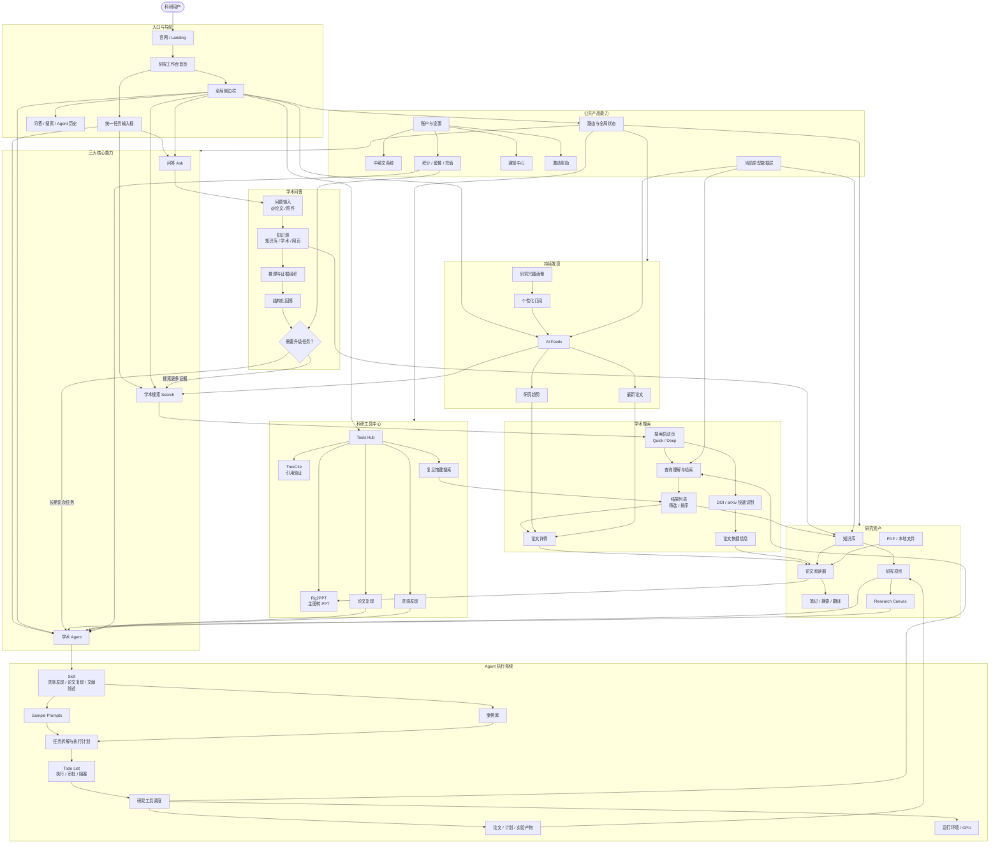

# WisPaper 产品架构图

```mermaid
flowchart TB
    User([科研用户])

    subgraph Entry["入口与导航"]
        Landing["官网 / Landing"]
        Workspace["研究工作台首页"]
        Composer["统一任务输入框"]
        Sidebar["全局侧边栏"]
        History["问答 / 搜索 / Agent 历史"]
    end

    User --> Landing --> Workspace
    Workspace --> Composer
    Workspace --> Sidebar --> History

    subgraph Core["三大核心能力"]
        Ask["问答 Ask"]
        Search["学术搜索 Search"]
        Agent["学术 Agent"]
    end

    Composer --> Ask
    Composer --> Search
    Composer --> Agent
    Sidebar --> Ask
    Sidebar --> Search
    Sidebar --> Agent

    subgraph AskFlow["学术问答"]
        AskInput["问题输入<br/>@论文 / 附件"]
        Sources["知识源<br/>知识库 / 学术 / 网页"]
        Reasoning["推理与证据组织"]
        Answer["结构化回答"]
        Escalate{"需要升级任务？"}
    end

    Ask --> AskInput --> Sources --> Reasoning --> Answer --> Escalate
    Escalate -->|"搜索更多证据"| Search
    Escalate -->|"长期复杂任务"| Agent

    subgraph SearchFlow["学术搜索"]
        SearchHome["搜索启动页<br/>Quick / Deep"]
        Identifier["DOI / arXiv 快速识别"]
        SearchEngine["查询理解与检索"]
        Results["结果列表<br/>筛选 / 排序"]
        QuickPaper["论文快捷信息"]
        Detail["论文详情"]
    end

    Search --> SearchHome
    SearchHome --> SearchEngine --> Results --> Detail
    SearchHome --> Identifier --> QuickPaper

    subgraph AgentFlow["Agent 执行系统"]
        Skills["Skill<br/>灵感发现 / 论文复现 / 文献综述"]
        Prompts["Sample Prompts"]
        Cases["案例库"]
        Plan["任务拆解与执行计划"]
        Todo["Todo List<br/>执行 / 审批 / 阻塞"]
        Orchestration["研究工具调度"]
        Output["论文 / 计划 / 实验产物"]
        GPU["运行环境 / GPU"]
    end

    Agent --> Skills
    Skills --> Prompts
    Skills --> Cases
    Prompts --> Plan
    Cases --> Plan
    Plan --> Todo --> Orchestration
    Orchestration --> SearchEngine
    Orchestration --> GPU
    Orchestration --> Output

    subgraph Knowledge["研究资产"]
        Library["知识库"]
        Reader["论文阅读器"]
        PDF["PDF / 本地文件"]
        Notes["笔记 / 摘要 / 翻译"]
        Projects["研究项目"]
        Canvas["Research Canvas"]
    end

    Results --> Library
    Detail --> Reader
    QuickPaper --> Reader
    Library --> Reader
    PDF --> Reader --> Notes
    Sources --> Library
    Output --> Projects
    Library --> Projects
    Projects --> Canvas
    Projects --> Agent
    Canvas --> Agent

    subgraph Discovery["持续发现"]
        Feeds["AI Feeds"]
        Trends["研究趋势"]
        Latest["最新论文"]
        Subscription["个性化订阅"]
        Profile["研究兴趣画像"]
    end

    Sidebar --> Feeds
    Profile --> Subscription --> Feeds
    Feeds --> Trends --> Detail
    Feeds --> Latest --> Detail
    Feeds --> Search

    subgraph Tools["科研工具中心"]
        ToolsHub["Tools Hub"]
        TrueCite["TrueCite<br/>引用验证"]
        Fig2PPT["Fig2PPT<br/>主图转 PPT"]
        Reproduction["论文复现"]
        Idea["灵感发现"]
        Fudan["复旦馆藏搜索"]
    end

    Sidebar --> ToolsHub
    ToolsHub --> TrueCite
    ToolsHub --> Fig2PPT
    ToolsHub --> Reproduction
    ToolsHub --> Idea
    ToolsHub --> Fudan
    Reader --> Fig2PPT
    Reproduction --> Agent
    Idea --> Agent
    Fudan --> Results

    subgraph Platform["公共产品能力"]
        Router["路由与全局状态"]
        Language["中英文系统"]
        Credits["积分 / 套餐 / 充值"]
        Account["账户与设置"]
        Notify["通知中心"]
        Invite["邀请奖励"]
        Data["当前原型数据层"]
    end

    Sidebar --> Router
    Router --> Core
    Router --> Knowledge
    Router --> Discovery
    Router --> Tools

    Account --> Credits
    Account --> Language
    Account --> Notify
    Account --> Invite
    Credits --> Agent
    Credits --> Escalate
    Data --> SearchEngine
    Data --> Library
    Data --> Feeds
```
